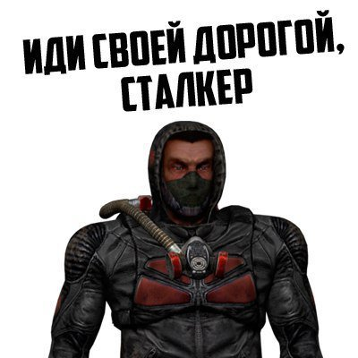

 
  

<!--обо мне-->

Я студент <strong>МГТУ им. Баумана</strong>, специалист по информационной безопасности автоматизированных систем.

Я победитель <strong>олимпиад</strong> "Шаг в будущее", "Покори Воробьёвы горы" и других.

Я член IT отдела студенческого совета ИУ, являюсь <strong>backend разработчиком</strong> на python.

<!--стек-->

<h3>Мой стек языков:</h3>

   
  
  
  
  
  

<h3>Мой стек технологий:</h3>

  
  
  
  
  
  
  

<!--статистика-->

 

